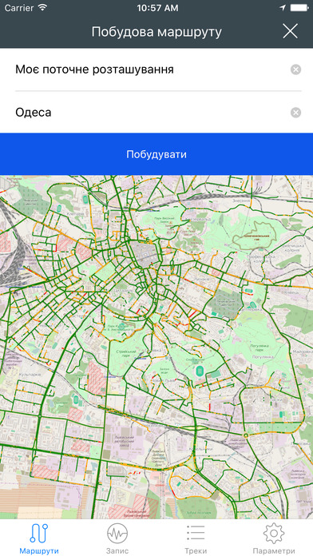
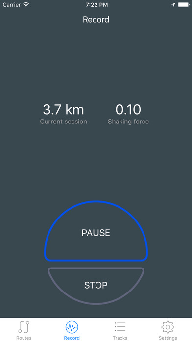
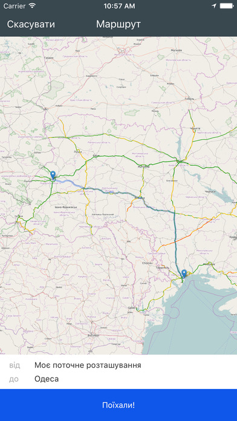
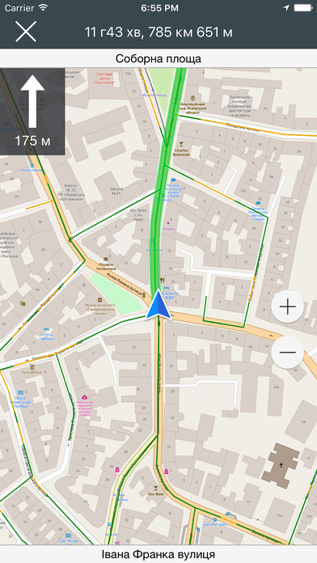

# UaRoads

UAroads is a unique service for road condition monitoring. It provides safety and comfort to drivers.
Project goal is to build routes through better roads with surface of higher quality.
Data on road quality is gathered automatically if GPS is turned on when a person is driving. Its accuracy is achieved by using a complex mathematical algorithm working on our server. Our findings are available on the official website of the project http://uaroads.com/
Until recently, the service was available only in Ukraine but now users from Romania, Moldova, Hungary, Slovakia, Austria, Czech Republic and Poland can use it as well.

Currently available on the App store.

## Contributing Bug reports
We use GitHub for bug tracking. Please search the existing issues for your bug and create a new one with label "bug" if the issue is not yet tracked!

https://github.com/stfalcon-studio/uaroads_ios/issues

## Contributing Ideas
Have something you want to say about UaRoads projects or want to be part of the conversation? Visit our [facebook page](https://www.facebook.com/uaroads/?fref=ts).

## Support
For troubleshooting and questions, please write to our support center!

uaroads@stfalcon.com

<!-- ## Documentation
Looking for documentation? Check out the wiki!
<Link to the documentation> -->

## License

The Apache 2.0 License

Copyright (c) 2017 stfalcon.com
